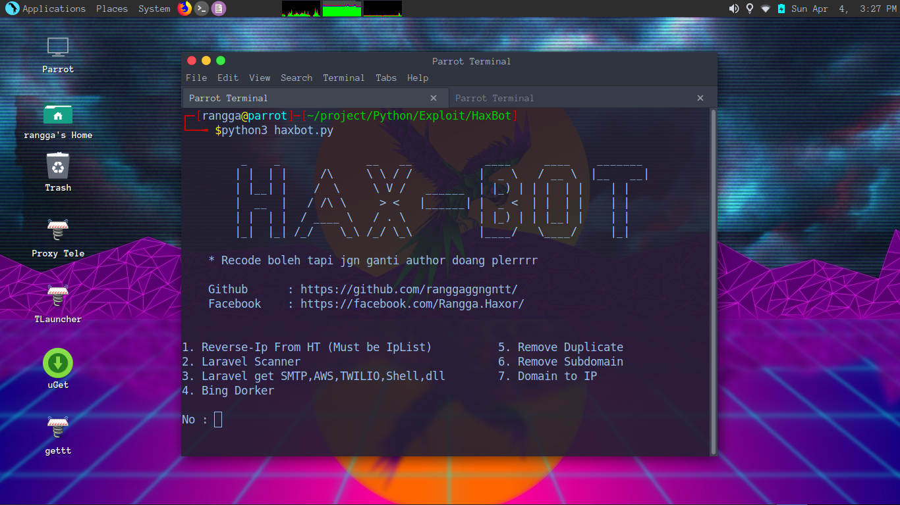

# HAX-BOT

This Tools Using Python3
Feature this tools:
- Reverse IP (Auto Grabbing Proxy)
- Site Scanner (Wordpress and Laravel)
- Laravel Exploit
- Bing Dorker
- Remove Duplicate
- Remove Subdomain
- Convert Domain to IP

# How to Usage

clone my project

      git clone https://github.com/ranggaggngntt/HAX-BOT.git
      
entering directories

      cd HAX-BOT
      
installing module requirements

      python3 -m pip install requirements.txt

running program

      python3 haxbot.py
      

If u want donate me : https://saweria.co/ranggaggngntt

u can use or learn using my code ❤️